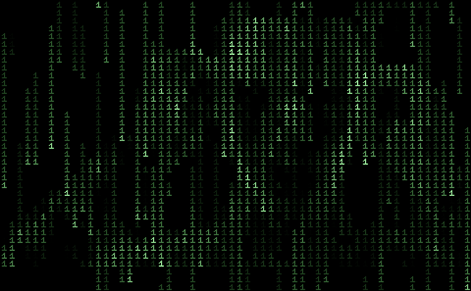

  

<h1 align="center">NL.LIVE - Live Chat Nederland</h1>

  

## Over NL.LIVE
NL.LIVE is de realtime chat hub voor alle steden in Nederland. Praat live met mensen in jouw stad zoals Amsterdam, Rotterdam, Utrecht en meer.

### Features
- Live chat per stad
- Beperking van 33 tekens per gebruiker per dag
- GPS authenticatie
- Real-time online teller
- Neon Matrix-stijl interface

### Steden
Amsterdam, Rotterdam, Utrecht, Eindhoven, Groningen, Tilburg, Almere, Breda, Nijmegen, Haarlem, Arnhem, Amersfoort, Zwolle, Leiden, Dordrecht, Venlo, Delft, Deventer, Leeuwarden, Alkmaar, Helmond, Heerlen, Oss, Hengelo, Purmerend, Roosendaal, Schiedam, Gouda, Assen, Bergen op Zoom, Capelle, Veenendaal, Zeist, Den Helder, Middelburg, Vlissingen, Goes, Terneuzen, Kerkrade, Weert, Roermond.

### Hoe te gebruiken
1. Open [NL.LIVE](https://nl.live/) in je browser.
2. Kies je stad uit de dropdownlijst.
3. Voer je naam in (A-Z, 0-9) en klik op **Klik Chat**.
4. Accepteer GPS-toegang voor authenticatie.
5. Begin met chatten!

### SEO & Metadata
- Realtime chat platform voor alle steden in Nederland.
- Elke stad heeft een aparte chatroom.
- Beperkt aantal tekens per gebruiker per dag om spam te voorkomen.

---

  

